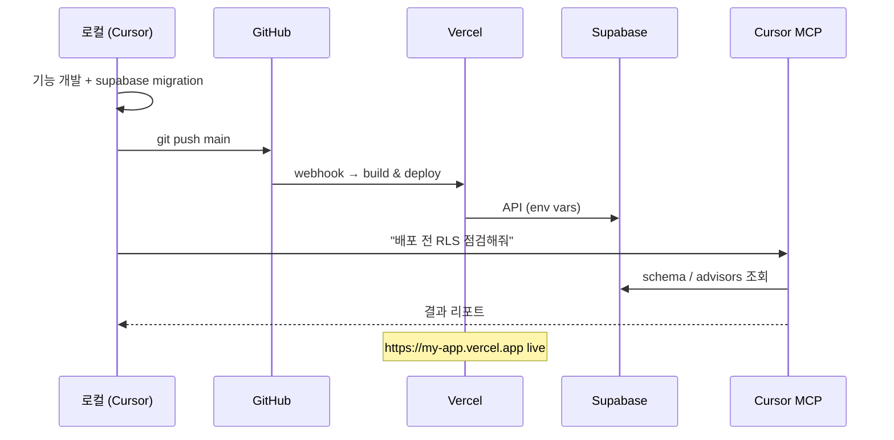

# 프로젝트 표준 스택: GitHub → Vercel → Supabase → Cursor MCP

웹/풀스택 프로젝트에 반복 적용할 **배포·데이터·AI 운영** 아키텍처입니다.

> **현재 `football-match-predictor`는 Streamlit(Python) 앱**이라 Vercel 대신 [Streamlit Community Cloud](DEPLOYMENT.md)를 사용합니다.  
> 아래 스택은 **Next.js / React / Node** 계열 프로젝트에 해당합니다.

---

## 한눈에 보기

```
┌─────────────────┐     push      ┌──────────────┐     webhook     ┌─────────────┐
│  로컬 프로젝트   │ ────────────► │   GitHub     │ ──────────────► │   Vercel    │
│  (Cursor IDE)   │               │  (소스 저장)  │   자동 배포      │  (호스팅)    │
└────────┬────────┘               └──────────────┘                 └──────┬──────┘
         │                                                                │
         │ MCP (설정·상태 조회)                                              │ API 호출
         ▼                                                                ▼
┌─────────────────┐               ┌──────────────┐                 ┌─────────────┐
│  Cursor + MCP   │ ◄────────────►│  Supabase    │ ◄───────────────│  사용자 브라우저│
│  (AI 에이전트)   │   SQL/스키마   │  (DB·Auth)   │                 │  *.vercel.app │
└─────────────────┘               └──────────────┘                 └─────────────┘
```

| 단계 | 역할 | 담당 |
|------|------|------|
| **로컬** | 코드 작성·테스트 | Cursor, Git |
| **GitHub** | 버전 관리, CI/CD 트리거 | `git push` |
| **Vercel** | 프론트/풀스택 자동 빌드·배포 | GitHub 연동 |
| **Supabase** | Postgres DB, Auth, Storage, Realtime | 클라우드 데이터 계층 |
| **Cursor MCP** | AI가 DB·프로젝트 상태 확인 | Supabase MCP 서버 |

---

## 1. 로컬 프로젝트

### 권장 구조 (Next.js 예시)

```
my-app/
├── app/                    # Next.js App Router
├── lib/
│   └── supabase/
│       ├── client.ts       # 브라우저용 (publishable key)
│       └── server.ts       # 서버용 (cookies / service role 주의)
├── supabase/
│   └── migrations/         # DB 스키마 버전 관리
├── .env.local              # 로컬 전용 (커밋 X)
├── .env.example            # 키 이름만 예시
├── .gitignore
└── package.json
```

### `.gitignore` 필수

```gitignore
.env
.env.local
.env*.local
node_modules/
.next/
.vercel/
```

### `.env.example` (템플릿)

```env
# Supabase (Dashboard → Project Settings → API)
NEXT_PUBLIC_SUPABASE_URL=https://xxxxx.supabase.co
NEXT_PUBLIC_SUPABASE_PUBLISHABLE_KEY=eyJ...

# Vercel에만 넣을 서버 전용 (브라우저 노출 금지)
SUPABASE_SERVICE_ROLE_KEY=eyJ...
```

> **규칙:** `NEXT_PUBLIC_` 접두사는 **브라우저에 노출**됩니다. `service_role` 키는 절대 `NEXT_PUBLIC_`로 두지 마세요.

---

## 2. GitHub에 push

[DEPLOYMENT.md — GitHub 섹션](DEPLOYMENT.md#3-github에-코드-올리기)과 동일한 흐름입니다.

```powershell
cd D:\path\to\my-app
git init
git branch -M main
git add -A
git commit -m "Initial commit"
gh repo create my-app --public --source=. --remote=origin --push
```

**Vercel 자동 배포를 위해:**

- 기본 브랜치: `main`
- `package.json`에 `build` 스크립트 존재
- 환경변수는 **GitHub에 넣지 않음** → Vercel 대시보드에서 설정

---

## 3. Vercel 자동 배포

### 3-1. 최초 연결 (1회)

1. https://vercel.com 접속 → **Sign in with GitHub**
2. **Add New → Project**
3. GitHub 저장소 `YOUR_USERNAME/my-app` 선택
4. Framework Preset: **Next.js** (자동 감지)
5. **Environment Variables** 입력:

| Name | Value | Environment |
|------|-------|-------------|
| `NEXT_PUBLIC_SUPABASE_URL` | Supabase Project URL | Production, Preview, Development |
| `NEXT_PUBLIC_SUPABASE_PUBLISHABLE_KEY` | publishable (anon) key | Production, Preview, Development |
| `SUPABASE_SERVICE_ROLE_KEY` | service role (서버 전용) | Production only (필요 시) |

6. **Deploy**

### 3-2. 이후 워크플로

```
코드 수정 → git commit → git push origin main
                ↓
         Vercel이 자동 빌드·배포 (1~3분)
                ↓
         https://my-app.vercel.app 갱신
```

- **Preview 배포:** PR 생성 시 `my-app-git-branch-username.vercel.app` 자동 생성
- **Production:** `main` 브랜치 push 시 production URL 갱신

### 3-3. `vercel.json` (선택)

```json
{
  "framework": "nextjs",
  "regions": ["icn1"]
}
```

---

## 4. Supabase — 데이터 저장소

### 4-1. 프로젝트 생성

1. https://supabase.com → **New project**
2. Region: **Northeast Asia (Seoul)** 권장
3. Database password 저장 (분실 시 복구 어려움)

### 4-2. 클라이언트 연결 (Next.js)

```bash
npm install @supabase/supabase-js @supabase/ssr
```

`lib/supabase/client.ts`:

```typescript
import { createBrowserClient } from "@supabase/ssr";

export function createClient() {
  return createBrowserClient(
    process.env.NEXT_PUBLIC_SUPABASE_URL!,
    process.env.NEXT_PUBLIC_SUPABASE_PUBLISHABLE_KEY!
  );
}
```

### 4-3. 스키마·마이그레이션

```bash
npm install -D supabase
npx supabase init
npx supabase link --project-ref YOUR_PROJECT_REF
npx supabase migration new create_initial_tables
# supabase/migrations/*.sql 편집
npx supabase db push
```

### 4-4. RLS (Row Level Security)

Supabase `public` 스키마 테이블은 **RLS 필수**:

```sql
alter table public.posts enable row level security;

create policy "Users read own posts"
  on public.posts for select
  using (auth.uid() = user_id);
```

### 4-5. Vercel ↔ Supabase 연동 (공식)

Supabase Dashboard → **Project Settings → Integrations → Vercel**  
또는 Vercel Marketplace에서 Supabase integration 설치 → env 자동 주입.

---

## 5. Cursor MCP — AI가 설정·상태 확인

Cursor에서 Supabase MCP를 연결하면 AI가 **SQL 실행, 스키마 조회, advisor, 로그** 등을 도구로 사용할 수 있습니다.

### 5-1. MCP 서버 설정 (수업: 프로젝트별 권장)

**프로젝트 루트** `.cursor/mcp.json` — 상세: [MCP.md](MCP.md)

```json
{
  "mcpServers": {
    "supabase": {
      "url": "https://mcp.supabase.com/mcp"
    },
    "vercel": {
      "url": "https://mcp.vercel.com"
    }
  }
}
```

| 서버 | URL | 용도 |
|------|-----|------|
| **Supabase** | `https://mcp.supabase.com/mcp` | 테이블·SQL·마이그레이션·advisor |
| **Vercel** | `https://mcp.vercel.com` | 배포 상태·로그·프로젝트 조회 |

전역 설정(모든 프로젝트): `%USERPROFILE%\.cursor\mcp.json` (Windows)에 동일 JSON 복사.

### 5-2. 인증 (OAuth, 각 1회)

1. **Cursor 재시작** — `Ctrl+Shift+P` → `Developer: Reload Window`
2. **Settings → Tools & MCP** 에서 서버 목록 확인
3. **Supabase** — `Needs login` 클릭 → 브라우저 OAuth → 프로젝트 권한 승인
4. **Vercel** — `Needs login` 클릭 → Vercel 계정 로그인 승인

연결 확인 (Supabase MCP 서버):

```bash
curl -so /dev/null -w "%{http_code}" https://mcp.supabase.com/mcp
# 401 → 서버 정상 (토큰 없음)
```

### 5-3. AI에게 시킬 수 있는 작업 예시

| 요청 | MCP 활용 |
|------|----------|
| "테이블 목록 보여줘" | `list_tables` |
| "users 테이블 RLS 확인" | `execute_sql` / advisors |
| "마이그레이션 상태" | migration 도구 |
| "느린 쿼리 점검" | advisors / logs |
| "프로덕션 env 빠진 것 없나" | Vercel env + Supabase keys 대조 |

> MCP는 **프로덕션 DB에 쓰기**가 가능할 수 있습니다. Cursor에서 **읽기 전용** 또는 **개발 프로젝트** 연결을 권장합니다.

---

## 6. 전체 워크플로 (일상)



### 새 기능 체크리스트

```
[ ] 로컬에서 npm run dev 성공
[ ] supabase migration 작성·적용 (필요 시)
[ ] .env.example 키 이름 업데이트
[ ] git push → Vercel Preview 확인
[ ] main merge → Production 확인
[ ] Supabase Dashboard에서 데이터·RLS 확인
[ ] (선택) Cursor MCP로 advisor/security 점검
```

---

## 7. 스택별 선택 가이드

| 프로젝트 유형 | 호스팅 | 데이터 |
|---------------|--------|--------|
| **Next.js / React SPA** | Vercel | Supabase |
| **Streamlit (Python)** | [Streamlit Cloud](DEPLOYMENT.md) | Supabase 또는 정적 JSON |
| **API only (FastAPI 등)** | Railway / Render / Fly.io | Supabase |
| **모바일 + 웹** | Vercel (web) | Supabase (공통 backend) |

---

## 8. 문제 해결

| 증상 | 확인 |
|------|------|
| Vercel 빌드 실패 | Vercel → Deployments → Build Logs |
| `Invalid API key` | Vercel env vs Supabase Dashboard 키 일치 |
| RLS로 데이터 안 보임 | Policy + `auth.uid()` 조건 |
| MCP 도구 안 보임 | `.cursor/mcp.json` + OAuth 재인증 |
| push해도 배deploy 안 됨 | Vercel ↔ GitHub integration, branch `main` |

---

## 9. 빠른 시작 명령 모음

```powershell
# 1. Next.js + Supabase 스캐폴드
npx create-next-app@latest my-app
cd my-app
npm install @supabase/supabase-js @supabase/ssr

# 2. GitHub
gh repo create my-app --public --source=. --remote=origin --push

# 3. Vercel CLI (선택)
npm i -g vercel
vercel link
vercel env pull .env.local

# 4. Supabase CLI
npx supabase init
npx supabase link --project-ref YOUR_REF
```

---

## 관련 문서

- [DEPLOYMENT.md](DEPLOYMENT.md) — GitHub + **Streamlit Cloud** (현재 Python 앱)
- [Supabase MCP 공식](https://supabase.com/docs/guides/getting-started/mcp)
- [Vercel + Supabase 가이드](https://supabase.com/docs/guides/getting-started/quickstarts/nextjs)

---

*마지막 업데이트: 2026-06-19*
